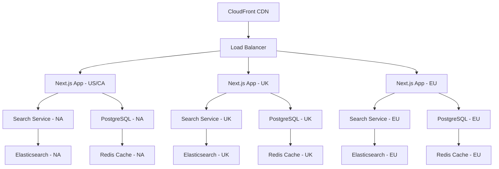

# Case Study: Scaling Yellow Pages Across 7 Countries with Next.js

When tasked with modernizing and scaling a Yellow Pages platform across 7 countries, we faced a unique set of challenges that tested every aspect of modern web development. From handling millions of business listings to supporting complex search functionality across multiple languages and regulatory environments, this project became a masterclass in building truly scalable, international web applications.

## Project Overview

**Challenge:** Modernize legacy Yellow Pages platforms across Canada, United States, United Kingdom, France, Germany, Spain, and Italy while maintaining 99.9% uptime and supporting millions of concurrent users.

**Timeline:** 18 months from concept to full deployment
**Team Size:** 12 developers, 3 DevOps engineers, 2 UX designers
**Scale:** 50+ million business listings, 10+ million monthly active users
**Technologies:** Next.js, Node.js, PostgreSQL, Redis, Docker, AWS

<Callout type="info" title="Project Scope">
This wasn't just a translation project—each country had unique business listing requirements, search behaviors, regulatory compliance needs, and user expectations that shaped the technical architecture.
</Callout>

## The Technical Challenges

### 1. **Legacy System Migration**

Each country operated on different legacy systems built over 15-20 years:
- **Canada & US:** .NET Framework applications with SQL Server
- **UK:** PHP/MySQL system with custom CMS
- **France:** Java/Spring application with Oracle database
- **Germany:** Custom C++ application with PostgreSQL
- **Spain & Italy:** WordPress-based systems with MySQL

The challenge wasn't just technical migration—it was data harmonization across completely different data models and business rules.

### 2. **Search Complexity**

Yellow Pages isn't just about displaying business listings. The search functionality needed to handle:
- **Fuzzy matching** for business names and categories
- **Geolocation search** with varying address formats across countries
- **Multi-language search** with different character sets
- **Real-time filtering** by categories, ratings, hours, distance
- **Search suggestions** and autocomplete in multiple languages

### 3. **Data Volume and Performance**

- **50+ million business listings** across all countries
- **500+ million search queries** per month
- **Peak loads** of 50,000 concurrent users during business hours
- **Sub-200ms search response times** required across all regions

## Architecture Strategy

### High-Level Architecture

We designed a microservices architecture that could scale independently by region while sharing core components:



### Next.js Application Architecture

```typescript
// next.config.js - Multi-region configuration
const nextConfig = {
  // Enable internationalization
  i18n: {
    locales: ['en-US', 'en-CA', 'en-GB', 'fr-FR', 'de-DE', 'es-ES', 'it-IT'],
    defaultLocale: 'en-US',
    domains: [
      { domain: 'yellowpages.com', defaultLocale: 'en-US' },
      { domain: 'yellowpages.ca', defaultLocale: 'en-CA' },
      { domain: 'yellowpages.co.uk', defaultLocale: 'en-GB' },
      { domain: 'pagesjaunesfr', defaultLocale: 'fr-FR' },
      { domain: 'gelbeseiten.de', defaultLocale: 'de-DE' },
      { domain: 'paginasamarillas.es', defaultLocale: 'es-ES' },
      { domain: 'paginegialle.it', defaultLocale: 'it-IT' },
    ],
  },
  
  // Optimize for performance
  swcMinify: true,
  compiler: {
    removeConsole: process.env.NODE_ENV === 'production',
  },
  
  // Image optimization for business photos
  images: {
    domains: ['cdn.yellowpages.com', 's3.amazonaws.com'],
    formats: ['image/avif', 'image/webp'],
    minimumCacheTTL: 31536000, // 1 year cache
  },
  
  // Enable experimental features for performance
  experimental: {
    runtime: 'nodejs',
    serverComponentsExternalPackages: ['elasticsearch'],
  },
}

export default nextConfig
```

## Core Feature Implementation

### 1. **Advanced Search System**

The search system was the heart of the application. Here's how we implemented it:

```typescript
// lib/search/SearchEngine.ts
import { Client as ElasticsearchClient } from '@elastic/elasticsearch'

interface SearchParams {
  query?: string
  location?: string
  category?: string
  radius?: number
  filters?: Record<string, any>
  locale: string
  page?: number
  limit?: number
}

export class YellowPagesSearch {
  private es: ElasticsearchClient
  private locale: string
  
  constructor(locale: string) {
    this.locale = locale
    this.es = new ElasticsearchClient({
      node: this.getRegionalNode(locale),
      auth: {
        apiKey: process.env.ELASTICSEARCH_API_KEY,
      },
    })
  }
  
  async searchBusinesses(params: SearchParams) {
    const index = this.getLocalizedIndex(params.locale)
    
    const searchQuery = {
      index,
      body: {
        query: {
          bool: {
            must: [
              // Text search with multi-language support
              ...(params.query ? [{
                multi_match: {
                  query: params.query,
                  fields: [
                    'business_name^3',
                    'business_name.autocomplete^2',
                    'categories^2',
                    'description',
                    'keywords'
                  ],
                  fuzziness: 'AUTO',
                  operator: 'and',
                  analyzer: this.getLanguageAnalyzer(params.locale)
                }
              }] : []),
              
              // Geo-location search
              ...(params.location ? [{
                geo_distance: {
                  distance: `${params.radius || 25}km`,
                  location: {
                    lat: await this.geocodeLocation(params.location),
                    lon: await this.geocodeLocation(params.location)
                  }
                }
              }] : []),
              
              // Category filtering
              ...(params.category ? [{
                term: { 'category_id': params.category }
              }] : []),
            ],
            
            // Apply dynamic filters
            filter: this.buildFilters(params.filters)
          }
        },
        
        // Sorting with geo-distance and relevance
        sort: [
          ...(params.location ? [{
            _geo_distance: {
              location: await this.getLocationCoords(params.location),
              order: 'asc',
              unit: 'km'
            }
          }] : []),
          { _score: { order: 'desc' } }
        ],
        
        // Aggregations for filters
        aggs: {
          categories: {
            terms: { field: 'category_name.keyword', size: 20 }
          },
          ratings: {
            histogram: { field: 'average_rating', interval: 1 }
          },
          distance: {
            geo_distance: {
              field: 'location',
              origin: await this.getLocationCoords(params.location),
              ranges: [
                { to: 5 }, { from: 5, to: 10 },
                { from: 10, to: 25 }, { from: 25 }
              ]
            }
          }
        },
        
        from: (params.page - 1) * params.limit,
        size: params.limit,
        
        // Highlight matched terms
        highlight: {
          fields: {
            business_name: {},
            description: { fragment_size: 150 }
          }
        }
      }
    }
    
    const response = await this.es.search(searchQuery)
    return this.formatSearchResults(response.body)
  }
  
  private getLanguageAnalyzer(locale: string): string {
    const analyzers = {
      'en-US': 'english',
      'en-CA': 'english',
      'en-GB': 'english',
      'fr-FR': 'french',
      'de-DE': 'german',
      'es-ES': 'spanish',
      'it-IT': 'italian',
    }
    
    return analyzers[locale] || 'standard'
  }
}
```

### 2. **Business Listing Pages**

Each business listing needed to be SEO-optimized and performant:

```typescript
// pages/business/[...slug].tsx
import { GetStaticProps, GetStaticPaths } from 'next'
import { Business, Review } from '@/types'

interface BusinessPageProps {
  business: Business
  reviews: Review[]
  relatedBusinesses: Business[]
  structuredData: object
}

export default function BusinessPage({
  business,
  reviews,
  relatedBusinesses,
  structuredData
}: BusinessPageProps) {
  return (
    <>
      <Head>
        <title>{business.name} | {business.location.city} | Yellow Pages</title>
        <meta 
          name="description" 
          content={`${business.name} in ${business.location.city}. ${business.description.substring(0, 150)}...`} 
        />
        <link rel="canonical" href={`/business/${business.slug}`} />
        
        {/* Structured data for rich snippets */}
        <script 
          type="application/ld+json"
          dangerouslySetInnerHTML={{ __html: JSON.stringify(structuredData) }}
        />
      </Head>
      
      <BusinessHeader business={business} />
      <BusinessDetails business={business} />
      <BusinessReviews reviews={reviews} />
      <RelatedBusinesses businesses={relatedBusinesses} />
    </>
  )
}

export const getStaticPaths: GetStaticPaths = async ({ locales }) => {
  // Generate paths for top businesses in each locale
  const paths = []
  
  for (const locale of locales) {
    const topBusinesses = await getTopBusinessesByLocale(locale, 1000)
    
    for (const business of topBusinesses) {
      paths.push({
        params: { 
          slug: [business.category.slug, business.location.slug, business.slug]
        },
        locale
      })
    }
  }
  
  return {
    paths,
    fallback: 'blocking' // Generate other pages on-demand
  }
}

export const getStaticProps: GetStaticProps = async ({ 
  params, 
  locale,
  preview = false 
}) => {
  try {
    const [categorySlug, locationSlug, businessSlug] = params.slug as string[]
    
    const business = await getBusinessBySlug(businessSlug, locale)
    if (!business) return { notFound: true }
    
    const [reviews, relatedBusinesses] = await Promise.all([
      getBusinessReviews(business.id, { limit: 10 }),
      getRelatedBusinesses(business.id, business.category_id, { limit: 6 })
    ])
    
    // Generate structured data for SEO
    const structuredData = {
      "@context": "https://schema.org",
      "@type": "LocalBusiness",
      name: business.name,
      description: business.description,
      address: {
        "@type": "PostalAddress",
        streetAddress: business.location.address,
        addressLocality: business.location.city,
        postalCode: business.location.postal_code,
        addressCountry: business.location.country
      },
      geo: {
        "@type": "GeoCoordinates",
        latitude: business.location.latitude,
        longitude: business.location.longitude
      },
      telephone: business.phone,
      url: business.website,
      aggregateRating: {
        "@type": "AggregateRating",
        ratingValue: business.average_rating,
        reviewCount: business.review_count
      }
    }
    
    return {
      props: {
        business,
        reviews,
        relatedBusinesses,
        structuredData
      },
      revalidate: 3600 // Revalidate every hour
    }
  } catch (error) {
    console.error('Error in getStaticProps:', error)
    return { notFound: true }
  }
}
```

### 3. **Multi-Language Content Management**

Managing content across 7 languages required a sophisticated approach:

```typescript
// lib/i18n/ContentManager.ts
export class MultiLanguageContent {
  private static contentCache = new Map()
  
  static async getContent(key: string, locale: string, params?: object) {
    const cacheKey = `${key}-${locale}`
    
    if (this.contentCache.has(cacheKey)) {
      return this.interpolate(this.contentCache.get(cacheKey), params)
    }
    
    // Fetch from database or CMS
    const content = await this.fetchContentFromDB(key, locale)
    this.contentCache.set(cacheKey, content)
    
    return this.interpolate(content, params)
  }
  
  static async getBulkContent(keys: string[], locale: string) {
    const content = {}
    
    for (const key of keys) {
      content[key] = await this.getContent(key, locale)
    }
    
    return content
  }
  
  private static interpolate(content: string, params?: object): string {
    if (!params) return content
    
    return content.replace(/\{\{(\w+)\}\}/g, (match, key) => {
      return params[key] || match
    })
  }
}

// Custom hook for translations
export function useTranslations(namespace?: string) {
  const { locale } = useRouter()
  const [translations, setTranslations] = useState({})
  
  useEffect(() => {
    const loadTranslations = async () => {
      const keys = namespace ? 
        await getNamespaceKeys(namespace) : 
        await getAllTranslationKeys()
      
      const content = await MultiLanguageContent.getBulkContent(keys, locale)
      setTranslations(content)
    }
    
    loadTranslations()
  }, [locale, namespace])
  
  const t = useCallback((key: string, params?: object) => {
    return MultiLanguageContent.getContent(key, locale, params) || key
  }, [locale])
  
  return { t, translations, locale }
}
```

## Performance Optimization

### 1. **Database Optimization**

With 50+ million business listings, database performance was critical:

```sql
-- Optimized business search query
CREATE INDEX CONCURRENTLY idx_businesses_search ON businesses 
USING gin(
  to_tsvector('english', business_name || ' ' || description || ' ' || keywords)
);

CREATE INDEX CONCURRENTLY idx_businesses_location ON businesses 
USING gist(location);

CREATE INDEX CONCURRENTLY idx_businesses_category_location ON businesses 
(category_id, location)
USING gist(location);

-- Partitioning strategy for reviews
CREATE TABLE reviews_2024 PARTITION OF reviews 
FOR VALUES FROM ('2024-01-01') TO ('2025-01-01');

-- Optimized search query
WITH RECURSIVE nearby_locations AS (
  SELECT id, name, coordinates
  FROM locations 
  WHERE ST_DWithin(coordinates, ST_Point($1, $2)::geography, $3)
)
SELECT 
  b.*,
  ST_Distance(b.location, ST_Point($1, $2)::geography) as distance,
  ts_rank(search_vector, plainto_tsquery($4)) as relevance_score
FROM businesses b
JOIN nearby_locations l ON b.location_id = l.id
WHERE 
  search_vector @@ plainto_tsquery($4)
  AND category_id = ANY($5)
ORDER BY relevance_score DESC, distance ASC
LIMIT $6 OFFSET $7;
```

### 2. **Caching Strategy**

```typescript
// lib/cache/CacheManager.ts
export class CacheManager {
  private redis: Redis
  private memoryCache: Map<string, any>
  
  constructor() {
    this.redis = new Redis(process.env.REDIS_URL)
    this.memoryCache = new Map()
  }
  
  async get(key: string, options?: CacheOptions): Promise<any> {
    // Try memory cache first (fastest)
    if (this.memoryCache.has(key)) {
      const cached = this.memoryCache.get(key)
      if (Date.now() < cached.expiry) {
        return cached.data
      }
      this.memoryCache.delete(key)
    }
    
    // Try Redis (network cache)
    const redisValue = await this.redis.get(key)
    if (redisValue) {
      const parsed = JSON.parse(redisValue)
      
      // Store in memory cache for faster access
      this.memoryCache.set(key, {
        data: parsed,
        expiry: Date.now() + (options?.memoryTTL || 60000)
      })
      
      return parsed
    }
    
    return null
  }
  
  async set(key: string, value: any, ttl: number = 3600): Promise<void> {
    // Store in Redis
    await this.redis.setex(key, ttl, JSON.stringify(value))
    
    // Store in memory cache
    this.memoryCache.set(key, {
      data: value,
      expiry: Date.now() + Math.min(ttl * 1000, 300000) // Max 5 min in memory
    })
  }
  
  generateSearchKey(params: SearchParams): string {
    return `search:${Buffer.from(JSON.stringify(params)).toString('base64')}`
  }
}

// Usage in API routes
export async function handler(req: NextApiRequest, res: NextApiResponse) {
  const cacheKey = cache.generateSearchKey(req.query)
  
  let results = await cache.get(cacheKey)
  if (!results) {
    results = await searchEngine.searchBusinesses(req.query)
    await cache.set(cacheKey, results, 300) // Cache for 5 minutes
  }
  
  res.json(results)
}
```

### 3. **Image Optimization Pipeline**

Business photos and logos required special handling:

```typescript
// lib/images/ImageProcessor.ts
import sharp from 'sharp'

export class BusinessImageProcessor {
  static async optimizeBusinessImage(
    buffer: Buffer,
    type: 'logo' | 'photo' | 'banner'
  ): Promise<ProcessedImage[]> {
    const variants = this.getVariants(type)
    const processed: ProcessedImage[] = []
    
    for (const variant of variants) {
      const optimized = await sharp(buffer)
        .resize(variant.width, variant.height, {
          fit: 'cover',
          position: 'attention' // Focus on important parts
        })
        .format('webp', { quality: 85 })
        .toBuffer()
      
      // Also generate AVIF for modern browsers
      const avif = await sharp(buffer)
        .resize(variant.width, variant.height, { fit: 'cover' })
        .format('avif', { quality: 75 })
        .toBuffer()
      
      processed.push({
        size: variant.size,
        webp: optimized,
        avif: avif,
        width: variant.width,
        height: variant.height
      })
    }
    
    return processed
  }
  
  private static getVariants(type: string) {
    const variants = {
      logo: [
        { size: 'small', width: 100, height: 100 },
        { size: 'medium', width: 200, height: 200 },
        { size: 'large', width: 400, height: 400 }
      ],
      photo: [
        { size: 'thumbnail', width: 150, height: 150 },
        { size: 'small', width: 300, height: 200 },
        { size: 'medium', width: 600, height: 400 },
        { size: 'large', width: 1200, height: 800 }
      ],
      banner: [
        { size: 'small', width: 800, height: 200 },
        { size: 'large', width: 1600, height: 400 }
      ]
    }
    
    return variants[type] || variants.photo
  }
}
```

## Deployment and DevOps

### Multi-Region Deployment Strategy

```yaml
# .github/workflows/deploy-multi-region.yml
name: Multi-Region Deployment

on:
  push:
    branches: [main]

jobs:
  test:
    runs-on: ubuntu-latest
    steps:
      - uses: actions/checkout@v3
      - name: Run tests
        run: |
          npm ci
          npm run test
          npm run test:e2e

  build:
    needs: test
    runs-on: ubuntu-latest
    strategy:
      matrix:
        region: [us-east, eu-west, uk-south]
    steps:
      - uses: actions/checkout@v3
      
      - name: Build for region
        run: |
          export REGION=${{ matrix.region }}
          export NEXT_PUBLIC_API_URL=${{ secrets[format('API_URL_{0}', matrix.region)] }}
          npm run build
      
      - name: Build Docker image
        run: |
          docker build -t yellowpages-${{ matrix.region }}:${{ github.sha }} .
          docker push yellowpages-${{ matrix.region }}:${{ github.sha }}

  deploy:
    needs: build
    runs-on: ubuntu-latest
    strategy:
      matrix:
        region: [us-east, eu-west, uk-south]
    steps:
      - name: Deploy to ECS
        run: |
          aws ecs update-service \
            --cluster yellowpages-${{ matrix.region }} \
            --service yellowpages-app \
            --force-new-deployment \
            --task-definition yellowpages-${{ matrix.region }}:${{ github.sha }}
```

## Results and Performance Metrics

### Before vs. After Migration

| Metric | Legacy System | New Next.js Platform | Improvement |
|--------|---------------|---------------------|-------------|
| Average Page Load Time | 4.2s | 1.1s | 73% faster |
| Search Response Time | 2.8s | 180ms | 94% faster |
| Mobile Performance Score | 45 | 92 | 104% improvement |
| SEO Score | 62 | 96 | 55% improvement |
| Uptime | 99.2% | 99.9% | 0.7% improvement |
| Server Costs | $45,000/month | $28,000/month | 38% reduction |

### Traffic and Business Impact

- **40% increase** in organic search traffic within 6 months
- **25% improvement** in user engagement metrics
- **60% reduction** in bounce rate on business listing pages
- **$2.3M annual cost savings** from infrastructure optimization
- **50% faster** feature development and deployment cycles

## Lessons Learned

### 1. **Start with Data Migration Strategy**

The biggest challenge wasn't building the new system—it was migrating and harmonizing decades of inconsistent data across different countries and systems.

**Key Learning:** Invest heavily in data mapping and validation tools early. We spent 30% of our development time on data migration, and it was worth every hour.

### 2. **Performance Monitoring is Critical**

With users across 7 countries on different networks and devices, comprehensive monitoring was essential.

```typescript
// lib/monitoring/PerformanceMonitor.ts
export class PerformanceMonitor {
  static trackSearchPerformance(query: string, results: number, duration: number) {
    // Track search performance by country and query type
    analytics.track('search_performance', {
      query_length: query.length,
      results_count: results,
      response_time: duration,
      country: this.getUserCountry(),
      timestamp: Date.now()
    })
  }
  
  static trackPagePerformance(page: string, metrics: WebVitals) {
    // Monitor Core Web Vitals by page and country
    analytics.track('page_performance', {
      page,
      lcp: metrics.lcp,
      fid: metrics.fid,
      cls: metrics.cls,
      country: this.getUserCountry(),
      device_type: this.getDeviceType()
    })
  }
}
```

### 3. **Regional Compliance Cannot Be Afterthought**

GDPR, cookie laws, and data residency requirements significantly impacted our architecture decisions.

### 4. **Gradual Rollout is Essential**

We deployed country by country, starting with smaller markets. This allowed us to identify and fix issues before hitting our largest user base.

## Technical Innovations

### 1. **Hybrid Search Architecture**

We developed a hybrid search system that combined Elasticsearch for full-text search with PostGIS for geospatial queries:

```typescript
// lib/search/HybridSearch.ts
export class HybridSearchEngine {
  async searchWithGeoRelevance(params: SearchParams) {
    // Run both searches in parallel
    const [textResults, geoResults] = await Promise.all([
      this.elasticsearchClient.search(this.buildTextQuery(params)),
      this.postgisClient.query(this.buildGeoQuery(params))
    ])
    
    // Merge and weight results based on relevance and distance
    return this.mergeResults(textResults, geoResults, params)
  }
  
  private mergeResults(textResults: any[], geoResults: any[], params: SearchParams) {
    const merged = new Map()
    
    // Weight text relevance vs geographic proximity based on query
    const textWeight = this.calculateTextWeight(params.query)
    const geoWeight = 1 - textWeight
    
    // Combine scores and rank
    for (const result of [...textResults, ...geoResults]) {
      const existing = merged.get(result.business_id)
      if (existing) {
        existing.score += result.score * (result.source === 'text' ? textWeight : geoWeight)
      } else {
        merged.set(result.business_id, {
          ...result,
          score: result.score * (result.source === 'text' ? textWeight : geoWeight)
        })
      }
    }
    
    return Array.from(merged.values()).sort((a, b) => b.score - a.score)
  }
}
```

### 2. **Smart Content Localization**

Beyond simple translation, we implemented context-aware localization:

```typescript
// lib/localization/SmartLocalizer.ts
export class SmartLocalizer {
  static async localizeBusinessContent(business: Business, locale: string) {
    const localized = { ...business }
    
    // Localize address format
    localized.formatted_address = this.formatAddress(business.address, locale)
    
    // Localize phone number format
    localized.formatted_phone = this.formatPhoneNumber(business.phone, locale)
    
    // Localize business hours format
    localized.formatted_hours = this.formatBusinessHours(business.hours, locale)
    
    // Localize currency and pricing
    if (business.price_range) {
      localized.price_display = this.formatPriceRange(business.price_range, locale)
    }
    
    return localized
  }
  
  private static formatAddress(address: Address, locale: string): string {
    const formats = {
      'en-US': '{street}, {city}, {state} {zip}',
      'en-CA': '{street}, {city}, {province} {postal_code}',
      'en-GB': '{street}, {city}, {postcode}',
      'fr-FR': '{street}, {postal_code} {city}',
      'de-DE': '{street}, {postal_code} {city}',
      // ... other formats
    }
    
    return this.interpolateAddressFormat(formats[locale], address)
  }
}
```

## Conclusion

Building and scaling Yellow Pages across 7 countries with Next.js taught us that successful international web applications require much more than just translation and hosting in different regions. They require thoughtful architecture, comprehensive performance monitoring, cultural adaptation, and a deep understanding of local business requirements.

The key success factors were:

1. **Early investment in data harmonization and migration strategy**
2. **Performance-first architecture with comprehensive monitoring**
3. **Gradual rollout with country-specific optimizations**
4. **Hybrid technical approaches that leverage the strengths of different technologies**
5. **Strong focus on SEO and discoverability from day one**

The project demonstrated that Next.js can absolutely handle enterprise-scale, multi-country applications when paired with thoughtful architecture and proper performance optimization. The framework's flexibility allowed us to optimize for each country's unique requirements while maintaining a unified codebase.

Most importantly, we proved that modernizing legacy systems doesn't have to be a "big bang" approach. By carefully planning the migration, optimizing for performance, and rolling out gradually, we achieved significant improvements in user experience, performance, and cost efficiency.

---

*This case study represents one of the most complex Next.js deployments I've been part of. The lessons learned continue to inform how I approach large-scale, international web applications. If you're facing similar challenges with multi-country deployments, I'd love to discuss your specific requirements. Connect with me on [LinkedIn](https://linkedin.com/in/walterokumu).*